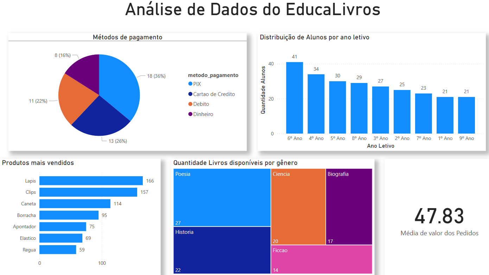

# Projeto 2 - Banco de Dados I

## Descrição do Projeto

Este projeto foi desenvolvido para a disciplina de Banco de Dados I, ministrada pelo professor Lucas Rodolfo Celestino de Farias. O objetivo era desenvolver um sistema de banco de dados integrado para uma escola que oferece ensino regular, possui uma biblioteca com serviço de empréstimos, e opera um e-commerce para a comercialização de produtos.

## Modelo Conceitual

Utilizando a ferramenta BrModelo, criamos o modelo conceitual que inclui diversas entidades como Aluno, Professor, Funcionário, Biblioteca, Produto, Pedido, entre outras. Este modelo também mapeia os relacionamentos chave, como Cliente e Empréstimo, Cliente e Pedido, e Professor e Disciplina.

## Modelo Lógico

A partir do modelo conceitual, foi desenvolvido o modelo lógico, que transforma as entidades em tabelas e os relacionamentos em chaves estrangeiras, preparando a base para a implementação física.

## Modelo Físico

Implementamos o modelo físico utilizando a ferramenta pgAdmin 4 para criar o esquema no banco de dados PostgreSQL. As tabelas foram configuradas conforme as especificações do modelo lógico.

## Implementação e Manipulação de Dados

Após a criação das tabelas, procedemos com a inserção de dados, realizando também operações de manipulação como inserções, atualizações e exclusões para simular a dinâmica operacional do sistema.

## Análise de Dados e Perguntas de Valor para o Negócio

Com o banco de dados em funcionamento, formulamos perguntas estratégicas para extrair insights valiosos para a gestão da escola:

1. No e-commerce, qual é o método de pagamento mais utilizado?
2. Quais são os produtos mais vendidos?
3. Qual é o valor médio dos pedidos?
4. Qual a disponibilidade atual de livros por gênero?
5. Qual é a distribuição de alunos por ano escolar?

Com a ferramenta de visualização de dados Power Bi, foi possivel responder as perguntas estratégicas para o negócio:

É possível tambem acessar a dashboard interativa, e aplicar os filtros clicando em produtos, metodos de pagamentos e etc

[Visite nosso DashBoard Interativo](https://app.powerbi.com/groups/me/reports/29c0a3cd-5187-4568-951e-4defd029eca3/ReportSection?experience=power-bi&redirectedFromSignup=1)

## Conclusão

Este projeto proporcionou uma experiência prática na construção e manipulação de um banco de dados, desde a modelagem conceitual até a análise de dados, usando ferramentas modernas de gestão de banco de dados.

## Créditos

Este projeto foi realizado com a colaboração dos seguintes membros da equipe:

- José Almir
- Álef Rodrigues
- Henrique Rojas
- Zhihang Lin
